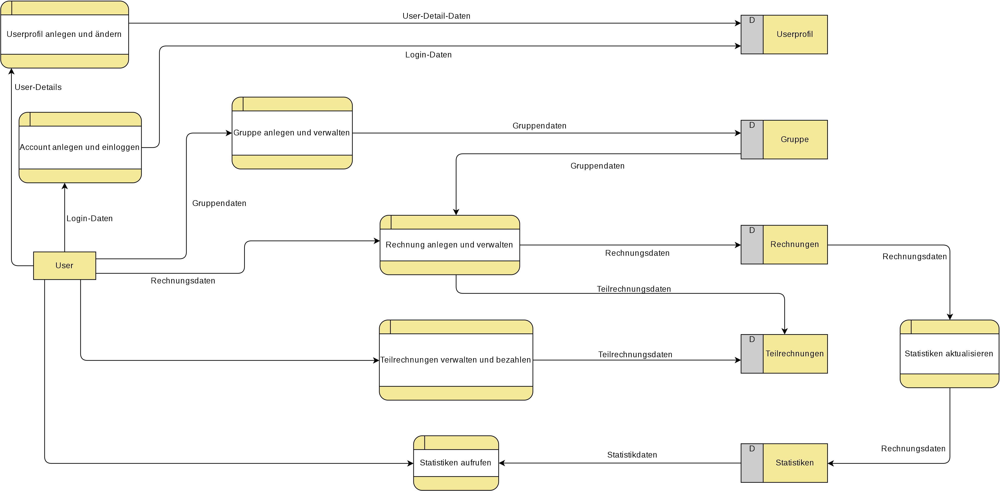
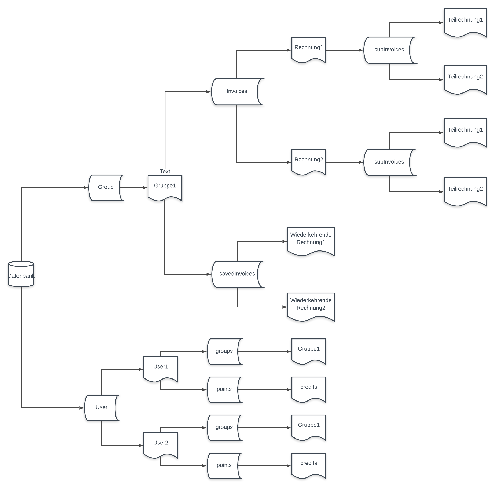
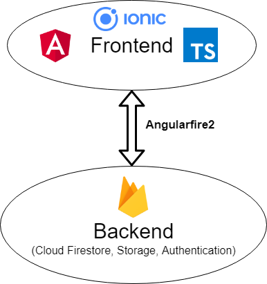
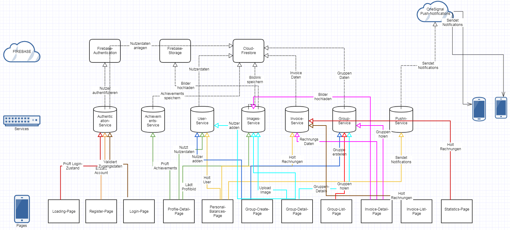

## Einleitung <br>

Im Rahmen des Moduls "Entwicklung mobiler Applikationen" wurde die hybride Applikation "Group Expenses" mit dem Framework [Apache Cordova](https://cordova.apache.org/) in Kombination mit dem [Ionic Framework](https://ionicframework.com/), welches [Angular als Modul](https://angular.io/start) verwendet, entwickelt. Dabei wurde die [Android SDK](https://developer.android.com/studio) als Targetplatform verwendet. <br>
Die entwickelte Applikation erlaubt es, innerhalb von erstellten Gruppen entstandene Rechnungen unter den zuvor hinzugefügten Gruppenmitgliedern zu teilen und die Rechnung über einen Upload bereitzustellen. Dabei wird der zu bezahlende Betrag gleichermaßen anteilig den Gruppenmitgliedern zugeordnet. Der Ersteller der Rechnung nimmt in diesem Szenario die Rolle des Begünstigten ein. Die Mitglieder haben die Möglichkeit ihre zu bezahlenden und noch offene Posten innerhalb eines Menüpunktes im User-Interface einzusehen und über ein Action-Button zu begleichen. <br>
Alle anfallenden Daten werden in der [Firebase-Cloud](https://firebase.google.com/) persistiert und durch Verwendung von Observables Zustandsänderungen im Datenfluss registriert, was sowohl eine Zustandsänderung in der Datenbank als auch beim aktiven Zugriff auf die Daten innerhalb der Komponente eine Änderung zur Folge hat. <br>
Innerhalb der Applikation werden [lokale Notifikationen](https://ionicframework.com/docs/native/local-notifications) bei entsprechend festgelegten Events getriggert. Bei Events wie das Erinnern oder das Bezahlen von einzelnen Posten wird eine Notifikation über die Restful API des Anbieters [OneSignal](ttps://onesignal.com) getriggert. 

## Inhalt <br>
* [Einleitung](#einleitung)
* [Anforderungen](#anforderungen)
    * [Anforderungsliste](Anforderungen)
    * [Requirement Template](Requirement Template)
* [Anwendungsfälle](#andwendungsfälle)
* [Projektstruktur](#projektstruktur)
    * [Projektstruktur-Grafik](Projektstruktur)
    * [Page Flow](Page-Flow)
    * [Framework Struktur](Framework)
* [Kontextabgrenzung](#kontextabgrenzung)
* [Systemkontext](#systemkontext-dokumentiert)
    * [Datenfluss-Diagramm](uploads/b7b43061021d7e48b0ca38afca60cb88/0001.jpg)
* [Datenbankstruktur](#datenbankstruktur)
* [Systemarchitektur](#systemarchitektur)
    * [Systemarchitekur Grafik](uploads/ed815bb7ad0648b3ad85ec2f27cc7674/SystArch.PNG)
* [Verwendete Werkzeuge und Bibliotheken](#verwendete-werkzeuge-und-bibliotheken)
* [Verwendete Plugins und Module](#verwendete-plugins-und-module)
* [Verwendete Dienste](#verwendete-dienste)
* [Einrichten der Entwicklungsumgebung](#einrichten-der-entwicklungsumgebung)
* [Sonstiges und Fazit](#sonstiges-und-fazit)


## Anforderungen<br>

Die [Anforderungen](Anforderungen) wurden entlang eines [Requirement Template](Requirement Template) gebaut um Transformationseffekte bei der Überführung zu vermeiden. Ein Ausschluss von Transformationseffekten kann ohne sorgfältige Prüfung nicht garantiert werden. Ergänzend zu den natürlich sprachlichen Anforderungen wird empfohlen modellbasierte Ansätze hinzuzuziehen. <br>
Vorgegebene Anforderungen waren:
* Unter dem Menüpunkt Erstellen oder Aufrufen einer Ausgabe/Einnahme soll die Applikation dem Benutzer die Möglichkeit bieten Belege, wie Rechnungen, Kassen-/Pfandbons als Bild in Form einer Aufnahme oder eines bestehenden Bildes hinzuzufügen.

* Nach dem Starten der Applikation soll das System dem Benutzer die Möglichkeit geben bestehende Gruppen anzuzeigen, zu löschen, zu aktualisieren und falls keine Vorhanden sind, eine neue Gruppe zu erstellen.

* Unter dem Menüpunkt Statistiken soll die Applikation dem Benutzer die Möglichkeit bieten grafische Auswertungen von Ausgaben/Einnahmen über einen bestimmten Zeitraum aufzulisten.

* Beim betätigen des Action-Buttons "Erinnern" soll die Applikation dem Benutzer die Möglichkeit bieten Zahlungserinnerungen über verschiedene Messenger-Dienste an den Betreffenden Schuldner zu übermitteln.

* Bei den Interaktionen Gruppe erstellen, Rechnung erstellen, Rechnung bezahlen soll die Applikation die Möglichkeit bieten Punkte zu sammeln, die in Form von Achievements unter dem Menüpunkt User-Profil einsehbar sind.

* Jede Aktion des Users, die eine Zustandsänderung innerhalb des Systems oder des Datenflusses hervorruft soll von der Applikation in Form von einer Speicherung festgehalten werden.


## Anwendungsfälle

Anwendungsfälle werden hier, beispielhaft für die Gruppenverwaltung, anhand eines Use Case Diagramms dargestellt


## Projektstruktur<br>

Um eine Übersicht bezüglich der Projektstruktur und der Komponentenstruktur zu vermittel ist sowohl der [Page-Flow](Page-Flow) grafisch dargestellt, als auch die Projektstruktur skizziert. <br>
Die [Projektsturktur](Projektstruktur) als gesamtes ist von "root dictonary" bis hin zu den Blättern der Struktur dargestellt. 
<br>
Um eine Entwicklung und Weiterentwicklung zu ermöglichen ist es wichtig ein allgemeines Verständnis über einen Aufbau der Frameworks und besonders den Aufbau und Funktionsweise des [Cordova Frameworks](Frameworks).

**Im folgenden alle verwendeten Klassen, Angular-Components und Services mit einer Kurzbeschreibung ihrer Funktion aufgeführt.** <br>

| **Components**     | **Funktion** |
| -------------------------- | ---------------------------|
| loading.page              | _Root Page, die aufgerufen wird sobald die App gestartet wird. leitet abhängig davon ob ein Nutzer eingeloggt ist auf die Gruppenübersicht oder die Login Seite weiter und zeigt eine Ladeanimation._  |
| login.page | _Ein Nutzer mit einem bestehenden Konto kann sich hier einloggen, oder über einen Link zur Registrieren Seite gelangen. Außerdem besteht die Möglichkeit den Google-Login zu nutzen._|
| register.page | _Ein Nutzer kann sich auf dieser Seite einen Account erstellen oder den Google-Login nutzen._|
| personal-balances.page | _Der Nutzer kann hier für jede Rechnung einzeln sehen, wem er Geld schuldet, oder von wem er noch Geld bekommt. Außerdem kann er die Ansicht wechseln, und alle Rechnungen zusammenfassen. Dann sieht er zusammengefasst wem er noch welchen Betrag schuldet, oder von wem er noch Geld erhält. Außerdem kann er andere Nutzer die ihm Geld schulden an die Zahlung erinnern._ |
| group-create.page | _Auf dieser Seite kann eine neue Gruppe erstellt werden. Beim Erstellen können wahlweise auch direkt Mitglieder über den Nutzernamen hinzugefügt werden. Außerdem kann der Ersteller zwischen einer der vorhandenen Kategorien für die Gruppe wählen, oder eine eigene erstellen._|
| group-detail.page | _Auf dieser Seite kann eine bestehende Gruppe bearbeitet werden. Außerdem kann eine Gruppe gelöscht werden, oder es können weitere Mitglieder hinzugefügt, oder Mitglieder entfernt werden._ |
| group-list.page | _Eine Übersicht aller Gruppen, in denen der Nutzer Mitglied ist. Durch einen Klick auf eine Gruppe gelangt der Nutzer zu allen Funktionalitäten der Gruppe, wie Statistiken, Übersicht über Balances etc._ |
| invoice-detail.page | _Hier kann der Nutzer je nach Modus eine neue Rechnung anlegen, oder eine bestehende bearbeiten oder löschen. Er kann zwischen den bestehenden Kategorien wählen, oder eine Eigene erstellen, die danach der Gruppe für alle weiteren Rechnungen zur Auswahl steht. Beim Erstellen einer Rechnung kann entweder eine komplett neue erstellt werden, oder aus einer Liste gespeicherter Rechnungen eine ausgewählt werden._ |
| invoice-list.page | _Übersicht über alle Rechnungen, die zu einer Gruppe existieren. Die Rechnungen können durchsucht oder nach Kategorien gefiltert werden. Durch den Klick auf eine Rechnung gelangt man in die Detailansicht._ |
| invoice-picker.page | _Hier kann der Nutzer aus Rechnungen, die er zur Wiederverwendung gespeichert hat auswählen_ |
| profile-detail.page | _Der Nutzer kann sein Profil einsehen oder bearbeiten, ein Bild hochladen, sein Passwort ändern, sich ausloggen oder seinen Account löschen._ |
| statistics.page | _Hier können die Statistiken über die Einnahmen und Ausgaben einer Gruppe grafisch eingesehen werden. Die Statistiken können nach Kategorie gefiltert werden._ |

| **Models**     | **Funktion** |
| -------------------------- | ---------------------------|
| GroupModel | _Diese Klasse repräsentiert eine Gruppe zu einem bestimmten Thema._ |
| InvoiceModel | _Eine Rechnung zu einer bestimmten Einnahme oder Ausgabe. Sie besteht neben allen nötigen Angaben zur Rechnung und einem Bild noch aus einer Anzahl an ```subInvoice```._ |
| subInvoice | _Beim Anlagen einer Rechnung werden zu dieser Rechnung subInvoices angelegt. In diesen wird für jeden Nutzer errechnet und hinterlegt, in welcher Höhe er sich an der Rechnung beteiligen muss._|
| TitleSubInvoice | _Diese Klasse weist den Subinvoices den Namen der dazugehörigen Rechnung (```InvoiceModel```) zu._ |
| UserBilanz | _Mit dieser Klasse wird der Gesamtbetrag errechnet, den ein Nutzer zu zahlen hat, oder von anderen Nutzern erhält._ |
| UserModel | _Diese Klasse hinterlegt zusätzliche Daten zu jedem Nutzer. Dabei werden Email und Passwort in der Authentication-Datenbank von Firebase hinterlegt, und ein Eintrag von ```UserModel``` in Cloud-Firestore. Diese werden über die UID verknüpft._ |

| **Services**     | **Funktion** |
| -------------------------- | ---------------------------|
| authentication.service | _Dieser Service wird verwendet, um einen neuen Nutzer zu registrieren oder einen bestehenden Nutzer einzuloggen. Dabei kommuniziert der Service mit Cloud-Firestore und Firebase-Authentication._ |
| group.service | _Dieser Service ist für das Erstellen und Bearbeiten von Gruppen zuständig. Dabei kommuniziert der Service mit Cloud-Firestore._ |
| images.service | _Über diesen Service wird das Kamera und Image-Picker Plugin bereitgestellt. Bilder können mit der Handykamera aufgenommen werden oder aus der Galerie ausgewählt werden. Über eine Upload Funktion werden die Bilder als Base64 String im Firebase-Storage gespeichert, und der dazugehörige Link wird zurückgegeben, und kann dann in Cloud-Firestore einem Objekt zugeordnet werden._ |
| invoice.service | _Dieser Service stellt alle Funktionalitäten zum erstellen, ändern und löschen von Rechnungen zur Verfügung, sowie Methoden um sich als Subscriber für Rechnungen bestimmter Gruppen anzumelden. Dieser Service kommuniziert mit Cloud-Firestore._ |
| pushn.service | _Mittels dieses Services können Push-Benachrichtigungen an Nutzer geschickt werden. Dazu kommuniziert der Service mit OneSignal._ |
| user-service.service | _Dieser Service wird verwendet um Nutzerdaten von Cloud-Firestore zu beziehen, das Profil anzupassen oder die Email oder das Passwort zu ändern. Dabei kommuniziert der Service mit Cloud-Firestore und Firebase-Authentication._ |

## Kontextabgrenzung <br>

Zur Bestimmung der [Kontextabgrenzung](Kontextabgrenzung) werden zunächst Elemente oder Aspekte definiert, die einen direkten Einfluss auf das System haben. Dabei wird das System als Blackbox dargestellt. Die im Kontext identifizierten Elemente sind:
* [Dokumente](Kontextabgrenzung)
* [Restful APIs](Kontextabgrenzung)
* [Benutzer](Kontextabgrenzung)
* [Cloud-Database](Kontextabgrenzung)
* [Hardware](Kontextabgrenzung)


## Systemkontext dokumentiert<br>

Zur hinreichenden Dokumentation des Systemkontextes wird ein Datenflussmodell erstellt, welches die Übertragung oder Übermittlung von Daten zwischen System oder Komponenten des Systems abbildet.
 


## Datenbankstruktur

Zur persistenten Speicherung der Daten wird die dokumentenorientierte Datenbank Firestore verwendet: Der grundsätzliche Aufbau wird im folgenden Schema erläutert:


Die User-Collection speichert alle notwendigen Daten zum User ab. In den dazugehörigen Subcollections werden die Gruppen des Users, in denen er Mitglied ist, festgehalten, sowie dessen Level und Punkte im Umgang mit Achievements. <br>
Die Group-Collection enthält alle relevanten Daten einer Gruppe. Sie enthält zwei Subcollections, in denen die innerhalb der Gruppe angelegten Rechnungen, sowie die wiederkehrenden Rechnungen gespeichert werden. Für jedes Rechnungsdokument wird eine weitere Subcollection angelegt, die alle zur Rechnung gehörenden Teilrechnungen speichert. Die Collection für wiederkehrende Rechnungen speichert wiederkehrende Rechnungen unabhängig von der Rechnungs-Collection, um auch nach erfolgten Zustandsänderungen der Rechnungen auf ihren ursprünglichen Zustand zugreifen zu können.

## Systemarchitektur

Im Backend werden Dienste von Google Firebase verwendet:
1. Cloud Firestore -> App Daten
2. Storage -> Speichern der von Nutzern hochgeladenen Bildern (Profil, Gruppe, Rechnung) 
3. Authentication -> Nutzerverwaltung

Für den Zugriff auf die in Firebase gespeicherten Daten und die Verknüpfung mit dem Frontend wird die AngularFire Bibliothek verwendet.

Das Frontend wird mit dem Ionic Framework umgesetzt, welches auf Angular und Apache Cordova basiert und auf die Standard Webtechnologien HTML, CSS, Sass und Javascript/Typescript aufbaut. 



 

## Verwendete Werkzeuge und Bibliotheken

|Bibliothek/Werkzeug | Version |Verwendung|
| -------- | -------- |-------- |
| [JDK](http://www.oracle.com/technetwork/java/javase/downloads/index.html)   | Java SE 8 JDK  |Java Compiler und Runtime   |
| [WebStorm](https://www.jetbrains.com/webstorm/)    | 2019.1.3   |IDE  |
| [Node.js](https://nodejs.org/en/)    | 6.9.0   |Package-Manager, Runtime  |
| [Apache Cordova](https://cordova.apache.org/docs/en/latest/)    | 2.0   |Framework,CLI  |
| [Ionic Framework](https://ionicframework.com/docs/intro)    | 4.0   |Framework, CLI  |
| [Android SDK](https://developer.android.com/studio)    | <19   |Target-Plattform |
| [Gradle](http://gradle.org/install)    | 5.01   |Build-Management |
| [AngularFire2](https://github.com/angular/angularfire2)    | 5.2.1 | Firebasezugriff
| [Typescript](https://www.typescriptlang.org/) | 3.2.4 | 


## Verwendete Plugins und Module
| Plugin | Verwendung |
| ------- | ------- |
| native-camera | _Plugin, das den Zugriff auf die Kamera des Gerätes gewährt und es erlaubt aufgenommene Bilder im Base64 Format zurückzugeben._ |
| image-picker | _Erlaubt es auf die Galerie des verwendeten Gerätes zuzugreifen, und gibt ausgewählte Bilder im Base64 Format zurück._ |
| Ng2GoogleChartsModule | _Erlaubt es Numerische Daten grafisch darzustellen. Wird auf der Statistik-Seite verwendet._ |
| ReactiveFormsModule | _Stellt reaktive Formulare zur Verfügung, und wird verwendet um eingegebene Nutzerdaten zu validieren._ |
|OneSignal Cordova Push Notification Plugin | _Ermöglicht die Interaktion mit der OneSignal Restful API._ |
|Screenshot | _Ermöglicht das erstellen von Screenshots als temporäre URI Datei._ |
|Social-Sharing | _Ermöglicht das direkte Teilen von Inhalten in den Sozialen-Applikationen._ |
|Local_Notification | _Ermöglicht das erstellen von lokalen Notifikationen._ |
| AngularFirestoreModule.enablePersistence() | _Erlaubt die Verwendung bestimmter Funktionen von Firebase ohne aktive Internetverbindung. Daten werden synchronisiert sobald eine Verbindung besteht._ |


## Verwendete Dienste
| Dienst | Funktion |
| ------- | ------- |
| [Cloud-Firestore](https://firebase.google.com/docs/firestore) | _Datenbank zum speichern und abrufen aller durch Nutzer der Applikation erstellten Daten_ |
| [Firebase-Storage](https://firebase.google.com/docs/storage) | _Cloud Storage zum speichern aller durch Nutzer der Applikation hochgeladenen Bilder. Die Bilder werden als Base64 String hinterlegt, und die Download-URL an entsprechender Stelle im Cloud-Firestore abgelegt, um darauf zugreifen zu können._ |
| [Firebase-Authentication](https://firebase.google.com/docs/auth) | _Dienst, der die gesamte Nutzer Authentifizierung übernimmt. Hier werden nur E-Mail und Passwort hinterlegt. Alle zusätzlichen Nutzerdaten liegen in einem gesonderten Eintrag in Cloud-Firestore, der über die User-ID verknüpft ist._ |
| [OneSignal](https://onesignal.com/) | _OneSignal ist eine Platform, die das Verwalten und Organsieren von Nutzergruppen und das Versenden von zielgruppenspezifischen Notifikationen als Dienst oder durch eine Restful API ermöglicht._ |

## Einrichten der Entwicklungsumgebung

Folgende Schritte müssen ausgeführt werden, um das Projekt zu entwickeln:

> Die verwendeten Entwicklungsumgebungen müssen in der richtigen [Versionierung](#verwendete-werkzeuge-und-bibliotheken) auf dem Gerät zur Verfügung stehen. <br>

Installation der [Cordova CLI](https://cordova.apache.org/#getstarted) mit dem Befehl `npm install -g cordova`.<br>
> Um diesen Befehl ausführen zu können müssen Sie [Node.js](https://nodejs.org/en/) herunterladen und installieren.<br>
> Der Befehl muss in einem Befehlsfenster ausgeführt werden.  <br>

 Installation der [Ionic CLI](https://ionicframework.com/docs/cli/) mit dem Befehl`npm install -g ionic`.<br>
> Um diesen Befehl ausführen zu können müssen Sie [Node.js](https://nodejs.org/en/) herunterladen und installieren.<br>
> Der Befehl muss in einem Befehlsfenster ausgeführt werden.  <br>

Clonen des [Git-Repository](https://git.thm.de/ema-ss19/group-expenses-schmitt.git). <br>
> Öffnen des Projektes in einer IDE der Wahl.

Navigieren in den Root-Ordner in der Projektstruktur und ausführen des Befehls `npm install` um alle Abhängigkeiten zu installieren. Durch das Ausführen des Befehls `npm update` um die in der `package-lock.json` hinterlegten Module zu installieren.
> Die in der `package-lock.json` hinterlegten Module werden mit den dort festgehaltenen Versionen installiert.
> Durch das Ausführen des Befehls `npm update` werden die Module in ihren Release-Versionen aktualisiert.

Einige Funktionalitäten greifen auf die Systemressourcen des Mobiltelefons zu, und stehen daher nur im Emulator oder auf einem entsprechenden Device zur Verfügung. Um eine installierbare APK der Applikation zu erhalten, müssen die folgenden Schritte ausgeführt werden:

> Hinzufügen einer oder mehrerer unterstützer Plattformen durch das [Ionic CLI](https://ionicframework.com/docs/cli/) `ionic cordova platform add ios|android|browser` <br>

> Erstellen der APK durch ```ionic cordova build android```

**Sie wollen ein eigenes Projekt erstellen?**

 Erstellen einer neuen Applikation mit `ionic start Projectname blank`.<br>

> Projectname ist der Dateiname und der Name der Applikation. <br>
> Das ausgewählte [Starter-Template](https://ionicframework.com/docs/v3/cli/starters.html) ist `blank`. <br>

 Wecheln in das "root dictionary" des Projektes mit`cd Projectname`.<br>

> Wechelt in das "root dictionary". <br>


## Sonstiges und Fazit

Bei unserem Projekt Group-Expenses für das Modul Entwicklungen Mobiler Applikationen haben wir viel gelernt. Insbesondere, da es verhältnismäßig wenige betreute Stunden gab, und man sich bei Problemen viel selbst über das Web (beispielsweise Stackoverflow) behelfen musste. Aber auch, wie es ist mit mehreren Leuten gemeinsam an einem Softwareprojekt zu arbeiten.
So haben wir im Laufe des Projekts immer besser gelernt uns miteinander abzustimmen. Für kommende Projekte würden wir beispielsweise im Voraus klar regeln, wie beispielsweise Variablen benannt werden müssen, und feste Strukturen festlegen nach denen gearbeitet wird. So hatten wir teilweise Probleme bei unseren wöchentlichen Treffen die einzelnen Teile zu mergen, oder uns im fremden Code zurechtzufinden. Insbesondere je komplexer und umfassender das Projekt wurde, desto fehleranfälliger wurde es auch.
Insgesamt sind wir mit dem Ergebnis sehr zufrieden, und hätten uns nur zum Ende hin etwas mehr Zeit gewünscht, um ihm den letzten Schliff zu geben.
Die Anforderungen, die wir im Voraus definiert hatten, haben wir alle umgesetzt. Bei unserer Sprintplanung haben wir verschiedene Teile umgestellt, da sich im Laufe der Entwicklung sinnvollere Abläufe aufgezeigt haben. So haben wir beispielsweise die Firebase-Anbindung direkt am Anfang realisiert, da sich zeigte, dass dies einige Prozesse vereinfachte und zusätzlichen Arbeitsaufwand ersparen würde. Insgesamt kamen wir auch mit der geschätzten Stundenzahl sehr gut hin. 
Folgende Punkte waren zum Zeitpunkt der Projektabgabe noch in aktiver Entwicklung, konnten aber zeitlich nicht mehr fertig gestellt werden:
1.	Überarbeitung der UI – sämtliche Seiten sollten noch einmal überarbeitet werden. Hier stand zunächst Funktionalität im Vordergrund
2.	Integration von Maps – Geo-Location beim Anlegen von Rechnungen (war nicht vollständig funktionstüchtig und wurde aus dem Nutzbereich der App entfernt)
3.	Offline-Support der App – Funktioniert zu teilen, konnte jedoch nicht mehr komplett fertig gestellt werden
4.	Optimierung von Requests – Gerade bei größeren Datenmengen wurde die App Teilweise langsam. Hier sollten einige Routen noch einmal überdacht/ überarbeitet werden, und der Offline-Support vollständig eingebunden werden, um ständiges Laden großer Datenmengen zu vermeiden.
5.	Überarbeitung der Push Notifications – Die Notifications sollten grafisch noch einmal überarbeitet werden.
